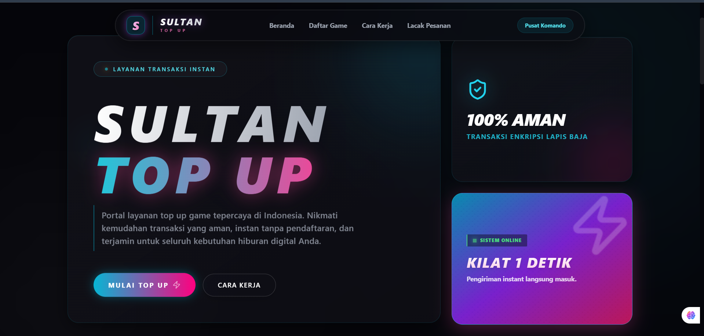
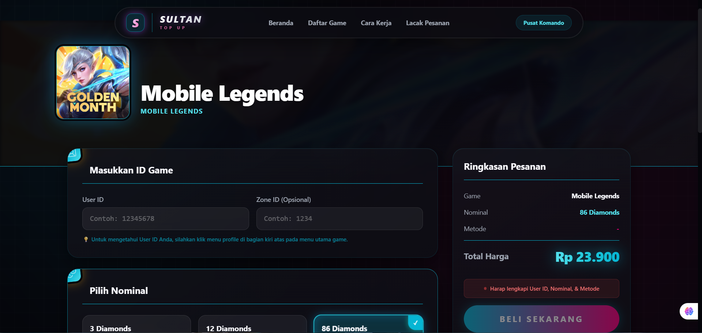
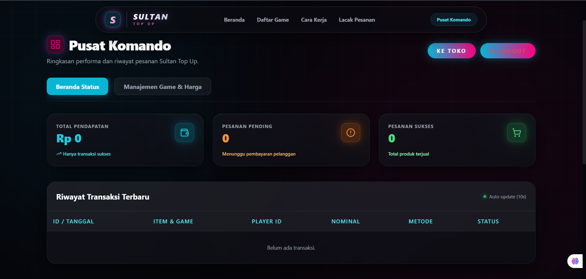

# 🎮 Sultan Top Up - Portal Layanan Game Premium VIP


Sultan Top Up adalah platform layanan transaksi instan kelas dunia untuk top up berbagai macam game populer. Didesain dengan antarmuka yang sangat modern (**Royal Obsidian Velvet & Satin Champagne Gold Theme**) serta dilengkapi dengan fitur keamanan tingkat militer, kecepatan transaksi kilat, dan modul interaktivitas game premium.

---

## 👥 Anggota Kelompok

Proyek web ini dikembangkan oleh kelompok kami:

1. **Bryan Alberta Hildan Pradana** (NIM: 223140148) - *Project Manager & Full-Stack Developer* (Memimpin jalannya proyek, mengintegrasikan sistem Frontend Next.js dan Backend Node.js)
2. **Ahmad Nurhidayat Maulana** (NIM: 223140129) - *Frontend Developer (UI/UX)* (Merancang antarmuka pengguna dengan Tailwind CSS, membuat animasi Framer Motion, dan memastikan desain responsif)
3. **Allen Virgustiyan Prakoso** (NIM: 223140136) - *Backend Developer (API & Database)* (Membangun REST API menggunakan Express.js dan mengelola skema database PostgreSQL menggunakan Prisma ORM)
4. **Iswara Pranidana Kartika Putra** (NIM: 223140107) - *Backend Developer (Payment & Security)* (Mengimplementasikan Payment Gateway Midtrans, serta mengelola keamanan autentikasi JWT dan Enkripsi)
6. **Abdul Muntolib Fajarkhan** (NIM: 223140120) - *Frontend Developer (Integration)* (Menghubungkan antarmuka UI Frontend dengan API Backend, menangani *state management*, dan *error handling*)
7. **Dani Ahmad Kafabih** (NIM: 223140145) - *Quality Assurance & System Analyst* (Melakukan pengujian sistem (QA), menyusun dokumentasi proyek, dan melakukan *deployment*)

---

## 🚀 Teknologi yang Digunakan

Proyek ini dibangun menggunakan arsitektur Modern Full-Stack (Frontend & Backend terpisah):

### Frontend
- **Framework:** [Next.js 14](https://nextjs.org/) (App Router)
- **Styling:** [Tailwind CSS](https://tailwindcss.com/) (Outift & Plus Jakarta Sans Font Family)
- **Animasi:** [Framer Motion](https://www.framer.com/motion/) (Smooth Stagger & Dynamic Accordion Transitions)
- **Icons:** [Lucide React](https://lucide.dev/)
- **Notifications:** [Sonner](https://sonner.emilkowal.ski/)

### Backend
- **Framework:** [Express.js](https://expressjs.com/) & [Node.js](https://nodejs.org/)
- **Database ORM:** [Prisma](https://www.prisma.io/)
- **Database:** SQLite / PostgreSQL (Prisma Multi-adapter)
- **Payment Gateway:** [Midtrans](https://midtrans.com/)
- **Security & Auth:** JWT, Bcrypt, Helmet, CORS, Rate Limiter

---

## ✨ Fitur Utama & Modul VIP Baru (V5)

- ⚡ **Transaksi Instan 1 Detik:** Pengiriman kilat tanpa perlu mendaftar/login yang rumit, terintegrasi Digiflazz API.
- 👑 **Tema Premium Royal Obsidian & Satin Gold:** Perombakan visual berkelas tinggi dari cyberpunk neon biasa ke kain beludru Obsidian pekat (`#030008`) dengan pendaran aksen Champagne Gold satin metalik (`#c5a880`) dan Royal Purple.
- ⚡ **Live Transaction Ticker (FOMO):** Baris kaca transparan berjalan horizontal berisi aktivitas data transaksi sukses terbaru gamer se-Indonesia secara real-time yang **berhenti otomatis saat kursor diarahkan (hover)**.
- 🏆 **Dewan Kehormatan Sultan (Leaderboard Spender):** Fitur gamifikasi visual yang menyajikan 3 posisi pembeli mingguan teratas dengan nominal top up yang berpendar emas, memicu persaingan kompetitif (Menampilkan anggota kelompok: **@BryanSultan, @AlanEsports, dan @DaniSultan**!).
- ⭐ **Karosel Testimonial Pelanggan VIP:** Slider ulasan bintang emas berbalut kaca *glassmorphism* dengan efek kilat bayangan transparan saat disentuh (*hover lift*).
- 💬 **FAQ Accordion Premium:** Seksi tanya-jawab interaktif legalitas dan pembayaran dengan transisi tinggi dinamis (*dynamic height*) menggunakan Framer Motion.
- 💬 **Tombol WhatsApp VIP Melayang:** Tombol bantuan support 24/7 yang melayang anggun dengan **efek denyut cahaya ganda (double-ring pulsing gold/green rings)** berpulsasi tenang.
- 🛡️ **Self-Healing Admin Registration:** Sistem aman yang secara mandiri mendeteksi database kosong dan menyajikan form inisialisasi akun Admin utama pada kunjungan pertama ke `/admin/login`.

---

## 📸 Tampilan Antarmuka (Screenshots)

| Halaman Utama | Halaman Transaksi Game | Halaman Admin Dashboard |
| :---: | :---: | :---: |
|  |  |  |

---

## 📂 Struktur Folder Proyek

```text
top-up-games/
├── frontend/               # Aplikasi Klien (Next.js 14)
│   ├── public/             # Aset gambar statis & Banner
│   ├── src/
│   │   ├── app/            # App Router (Home, Game Detail, Lacak, Admin)
│   │   ├── components/     # Komponen UI (Navbar, Footer, GameCard, AdminTab)
│   │   └── lib/            # Fungsi utilitas klien
│   └── tailwind.config.ts  # Konfigurasi Styling Outfit & Brand Colors
│
└── backend/                # Aplikasi Server API (Express.js)
    ├── prisma/
    │   ├── schema.prisma   # Struktur Database ORM SQLite/PostgreSQL
    │   └── seed.ts         # Data awal (seeding) game, voucher, dan nominal
    └── src/
        ├── controllers/    # Logika proses dari setiap endpoint
        ├── routes/         # Definisi jalur API (API Routes)
        └── utils/          # Konfigurasi Midtrans, Digiflazz & Sync-Katalog
```

---

## 📡 Dokumentasi API Utama

| Method | Endpoint | Deskripsi |
| --- | --- | --- |
| `GET` | `/api/games` | Mengambil seluruh katalog game lengkap |
| `GET` | `/api/games/:id` | Mengambil detail game beserta produk/item top-up |
| `POST` | `/api/transactions` | Membuat pesanan baru & mendapatkan URL Midtrans/Sandbox |
| `GET` | `/api/transactions/:orderId` | Mengecek status pesanan |
| `GET` | `/api/admin/setup-status` | Mengecek apakah admin pertama sudah terdaftar |
| `POST` | `/api/admin/setup` | Inisialisasi admin pertama (Self-healing) |
| `POST` | `/api/auth/login` | Login khusus Admin untuk mendapatkan token JWT |

---

## ⚙️ Cara Menjalankan Proyek Secara Lokal

Pastikan Anda sudah menginstal **Node.js** dan **npm**.

### 1. Kloning Repositori
```bash
git clone https://github.com/bryanalberta/top-up-games.git
cd top-up-games
```

### 2. Setup Backend (API Server)
Buka terminal dan jalankan:
```bash
cd backend
npm install
```

Buat file `.env` di dalam folder `backend`:
```env
PORT=5000
DATABASE_URL="file:./dev.db" # SQLite local database
MIDTRANS_SERVER_KEY="SB-Mid-server-xxxx"
JWT_SECRET="sultan_top_up_super_secret_key"
FRONTEND_URL="http://localhost:3000"
```

Jalankan seeding database dan jalankan server dev:
```bash
npx prisma generate
npx ts-node prisma/seed.ts  # Menjalankan seeding katalog & gambar premium baru
npm run dev
```
Backend akan berjalan di `http://localhost:5000`.

### 3. Setup Frontend (Web UI)
Buka terminal baru dan jalankan:
```bash
cd frontend
npm install
```

Buat file `.env.local` di dalam folder `frontend`, berisi:
```env
NEXT_PUBLIC_API_URL="http://localhost:5000/api"
```

Jalankan server tampilan web Next.js:
```bash
npm run dev
```
Frontend akan berjalan di `http://localhost:3000`. Buka alamat tersebut di browser Anda.

---
*Dibuat untuk memenuhi tugas kelompok / project pemrograman web.*
